# Linux Project for Commands

## 'pwd'command

###

## 'cp' command
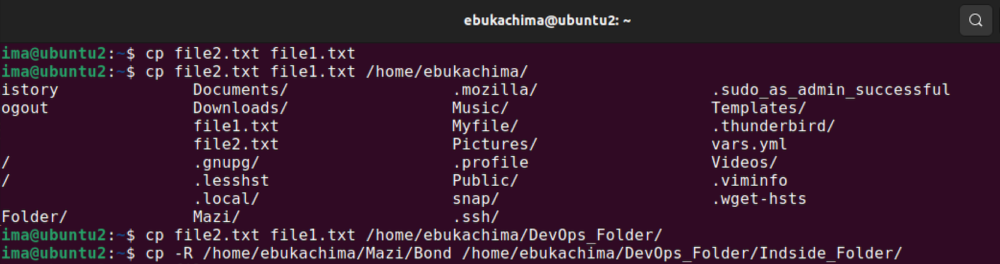
###

## 'sudo apt upgrade' command

###

## 'pwd' command

###

## 'mv' command

###

## 'mkdir' command

###

## 'find' command

###

## 'grep' command

###

## 'head' command
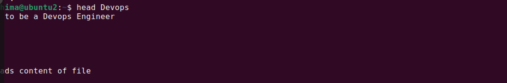
###

## 'tail' command
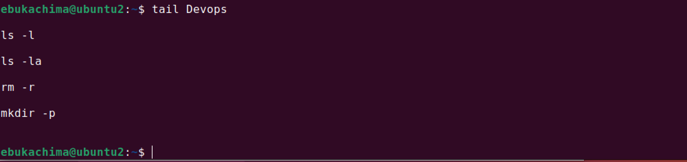
###

## 'top' command
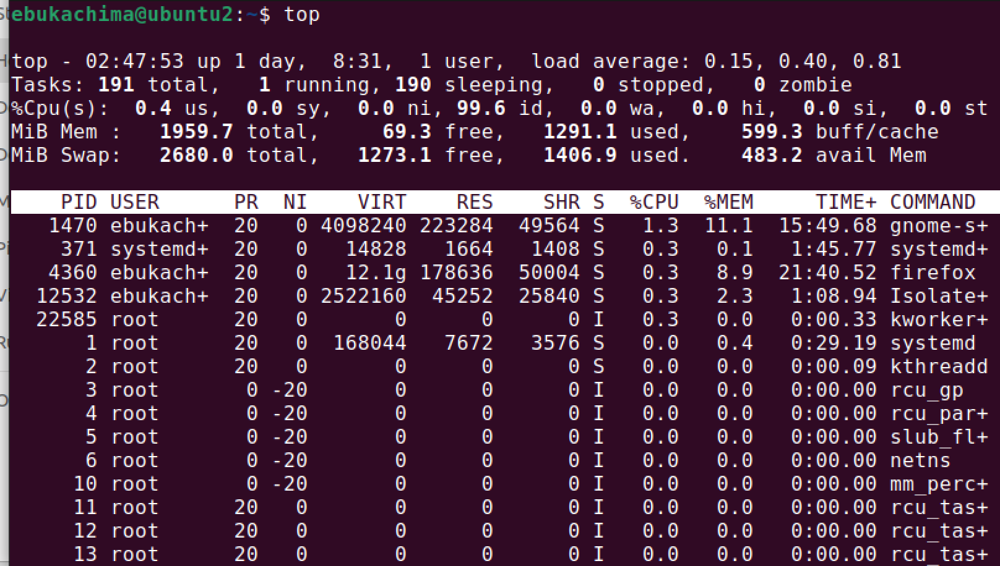

## 'htop' command
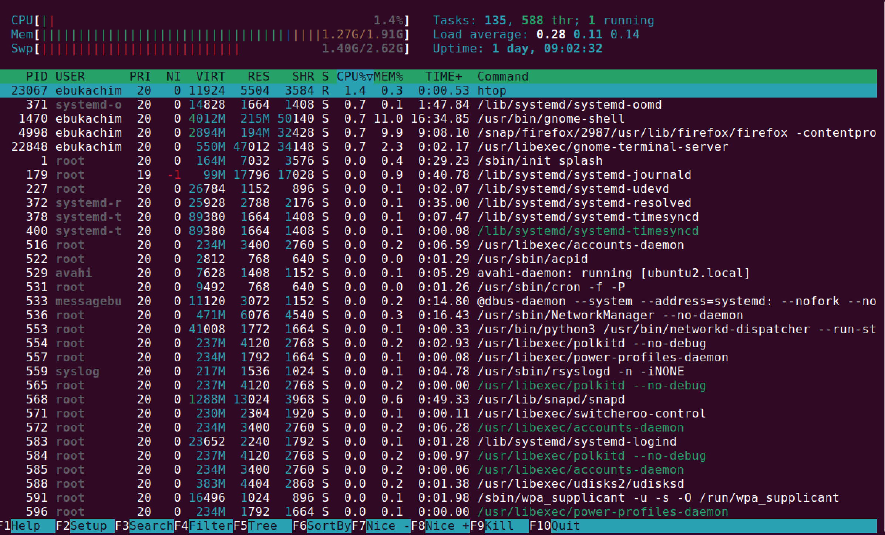
###

## 'df' command
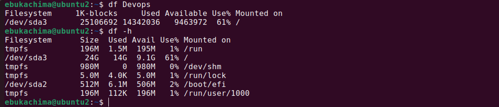
###

## 'du' command
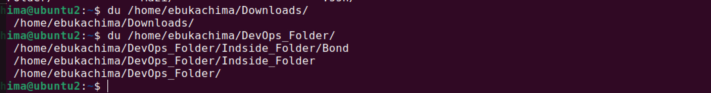

## 'ls' command
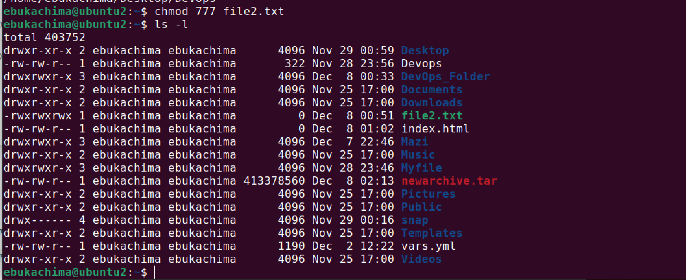
###

## 'ping' command
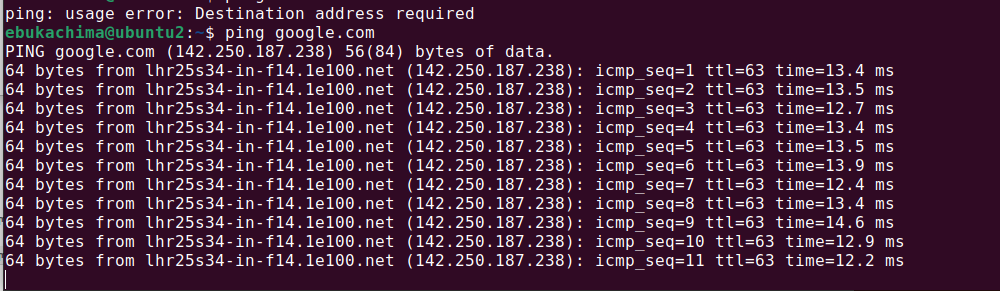
###

## 'wget' command
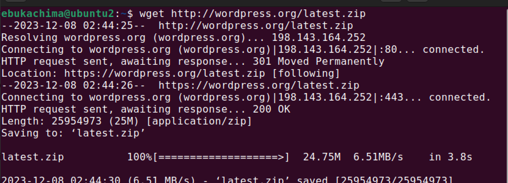
###
## 'uname' command
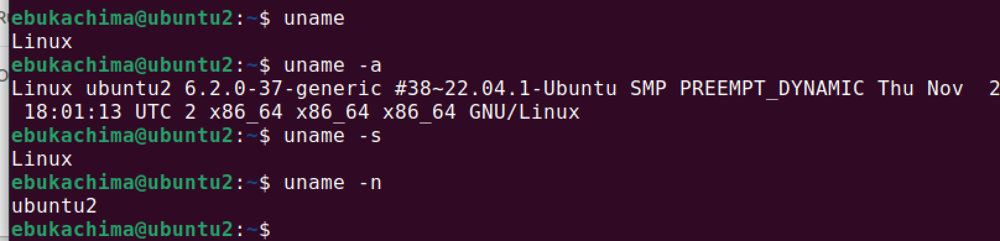
###

## 'hostname' command
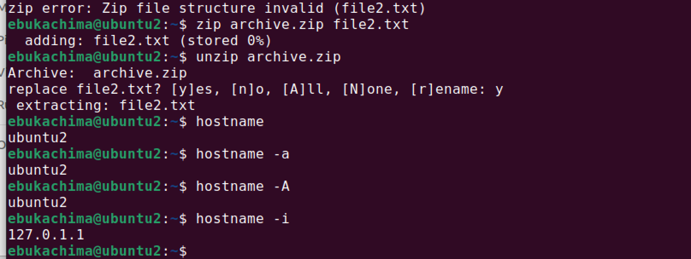
###

